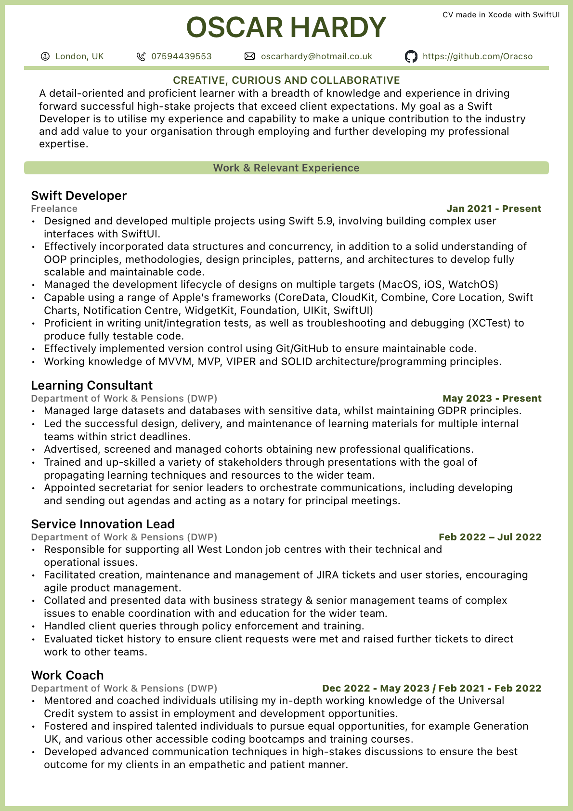
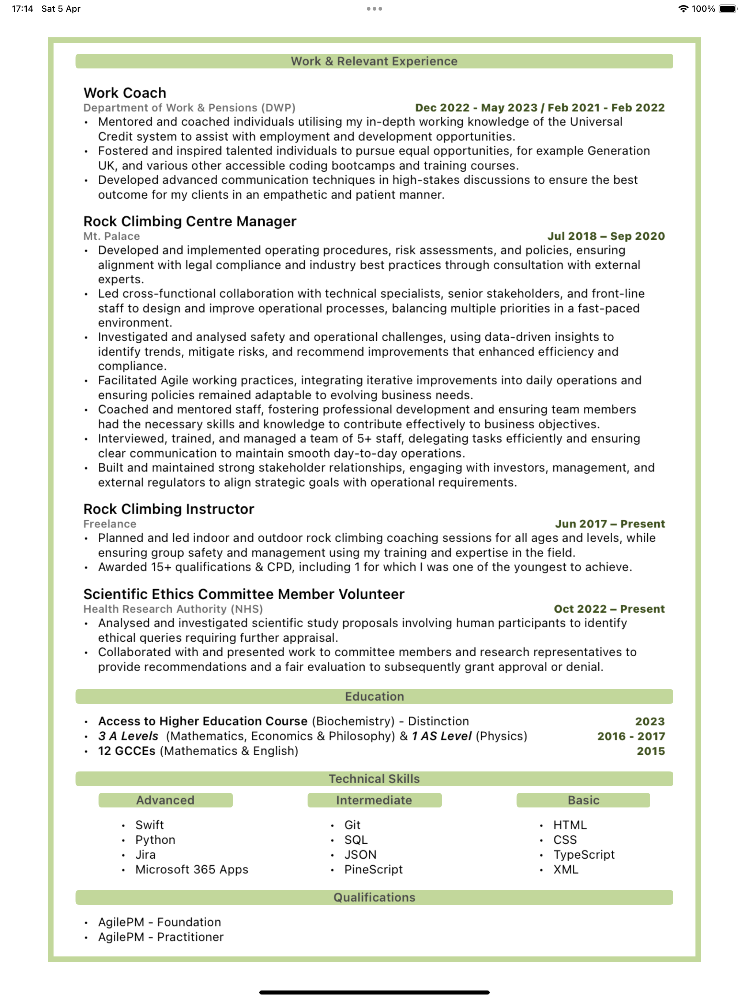

# SwiftUI CV

<section align="center">
&nbsp;&nbsp;&nbsp;&nbsp;&nbsp;
  
  &nbsp;&nbsp;&nbsp;&nbsp;&nbsp;
  
</section>

### Overview:

My SwiftUI CV that has been designed and built dynamically within Xcode using SwiftUI.

### Use Case:

Having a CV template that dynamically adapts to updates while maintaining its theme and structure enables CVs to be seamlessly tailored to specific job roles. This separation of a CV's content from its design allows users to select themes contextually, keeping their CVs professional and appropriate for each application. Further, this approach also facilitates content version control, allowing users to easily manage multiple versions attuned to particular roles or as they are updated throughout a career. 

    
Contents:

    <ul class="overview-section">
        <li><h3><a href="#future-plans">Future Plans</a></h3></li>
        <li><h3><a href="#current-difficulties">Current Difficulties</a></h3></li>
        <li><h3><a href="#past-problems">Past Problems</a></h3></li>
        <li><h3><a href="#screenshots">Screenshots</a></h3></li>
        <li><h3><a href="#licensing">Licensing</a></h3></li>
    </ul>

&nbsp;

# Project Progression

## Future Plans:

#### - <ins>Theme Templates & Content Presets</ins>

I would like to have a simple in-app UI that facilitates switching between saved themes and altering CV content such including or excluding certain skills or work experience history. There would also be a simple in-app way of adjusting template design e.g. colour, margin size, padding.

## Current Difficulties:

#### - <ins>Separating the view into multiple A4 'pages' </ins>

Although the app can calculate the overall size of the view to determine the number of A4 'pages' it spans and then create the margin for this, it is unable to actually separate the view into it's constituent pages and create independent margins for them. The current work around is to see where one 'page' would cut off, and then manually omit certain elements of the view so that it only takes up one page. A screenshot can be taken and this process repeated for as many pages as are left. The solution will likely involve some use of **GeometryReader** in order to separate pages, but also to ensure that some view elements are not split between pages.

#### - <ins>Exporting CV to PDF</ins>

I've yet to find a simple way of using **PDFKit** to export views to PDF, although it can manipulate PDFs, creating them, especially within certain view constraints is a little harder. The way the standard A4 view size calculated may need to be dynamically linked and used to scale to the size of the device screen. The current method of creating a final PDF is to screenshot views on the simulator and then manually crop them. 

## Past Problems:

#### - <ins>Limiting A4 'Page' Size</ins>

I had some initial difficulty converting metric A4 measurements to Apple's resolution 'points'.

#### - <ins>CV Section Selection</ins>

<!-- # Screenshots -->

### Licensing

There is [no license](https://choosealicense.com/no-permission/) associated with this project other than usual GitHub [Terms of Service](https://docs.github.com/en/site-policy/github-terms/github-terms-of-service), however, please be mindful and acknowledge me as the original author if you use significant or distinct portions of this code.

<!-- 

https://github.com/anuraghazra/github-readme-stats -->